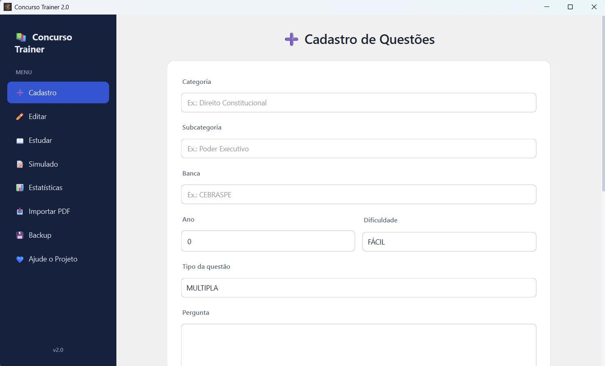
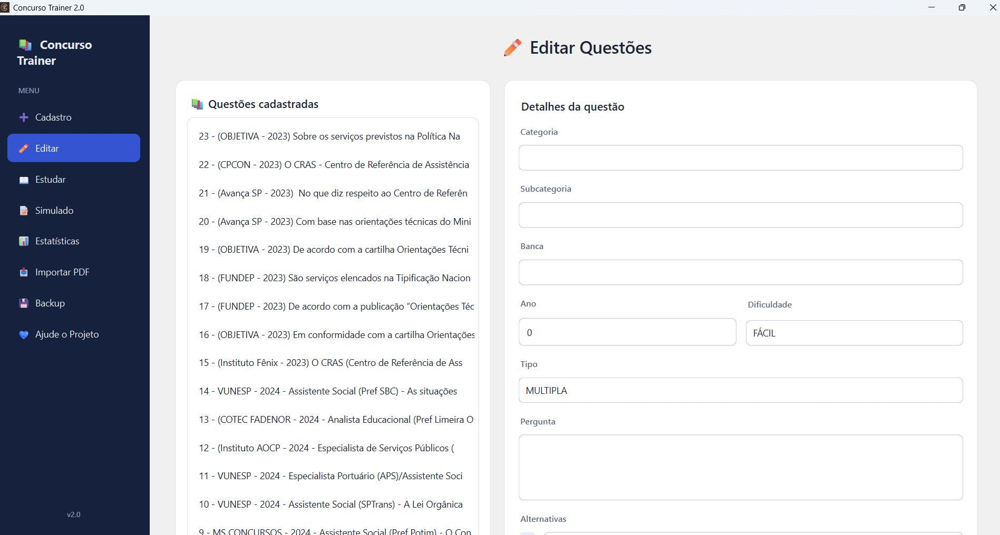
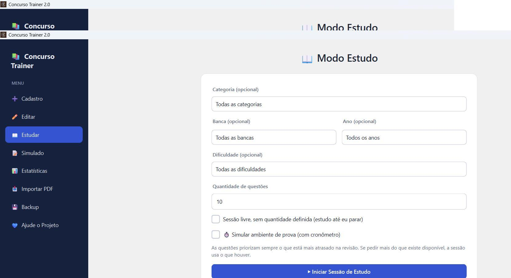
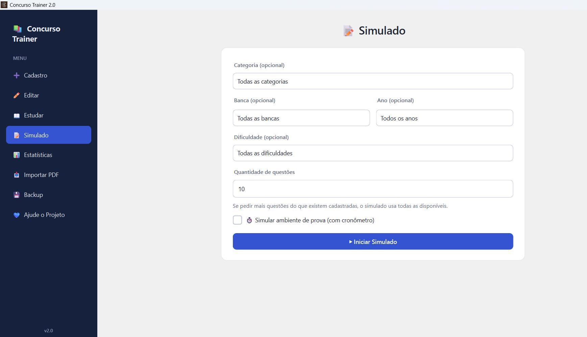
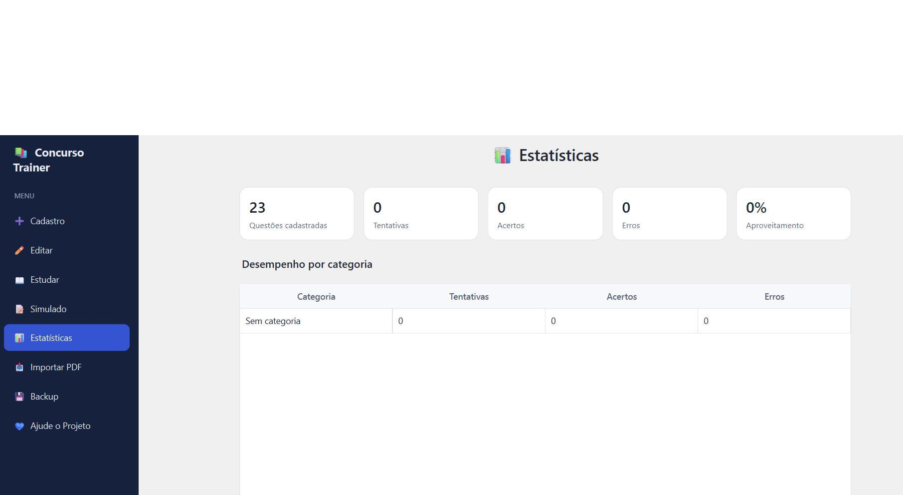
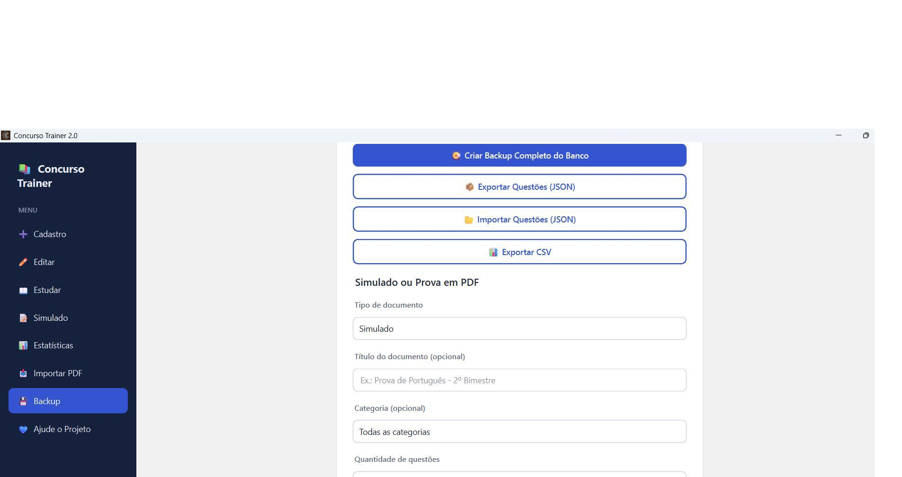

# 📚 Concurso Trainer

<p align="center">
  
</p>

<h1 align="center">Olá, concurseiro! 👋</h1>

<p align="center"><strong>Seu ritmo. Suas questões. Sua preparação.</strong><br>Organize seu banco de questões e estude para concursos públicos direto no computador.</p>

<p align="center">
  <a href="https://drive.google.com/file/d/1WGrHlfoKhiJhLhY2F_ecixkjdjQu6Hl4/view?usp=drivesdk"><strong>⬇️ BAIXAR PARA WINDOWS 64 BITS</strong></a>
  &nbsp; · &nbsp;
  <a href="https://github.com/marcelosantiagok/concurso_trainer">Ver o projeto no GitHub</a>
</p>

<p align="center">
  
  
  
  
  
</p>

## Estude do seu jeito

O **Concurso Trainer** é um aplicativo gratuito para você cadastrar e organizar suas próprias questões, praticar e acompanhar seu desempenho. Sem anúncios, sem assinatura e sem precisar criar uma conta: seus dados ficam no seu computador.

- **Monte seu próprio banco:** cadastre questões de múltipla escolha ou de certo/errado e organize por categoria, assunto, banca, ano e dificuldade.
- **Estude no seu ritmo:** escolha filtros e quantidade de questões para cada sessão.
- **Compartilhe com colegas:** exporte seu banco em JSON e envie o arquivo a quem quiser. A outra pessoa pode importar os dados no aplicativo. Compartilhe apenas questões que você tem autorização para distribuir.
- **Acompanhe sua evolução:** consulte estatísticas e histórico de tentativas.
- **Revise com frequência:** questões acertadas avançam por intervalos de 1, 2, 4, 7, 15, 30 e 60 dias; questões erradas voltam ao primeiro nível.

> O aplicativo organiza seus estudos, mas não substitui o edital, materiais oficiais nem a conferência das respostas e dos direitos de uso das questões.

## O aplicativo por dentro

<p align="center"><strong>Cadastre e organize as questões que fazem sentido para a sua preparação.</strong></p>
<p align="center"></p>

<p align="center"><strong>Edite seu banco e acompanhe as questões cadastradas.</strong></p>
<p align="center"></p>

<p align="center"><strong>Pratique com sessões de estudo e simulados.</strong></p>
<p align="center"></p>
<p align="center"></p>

<p align="center"><strong>Veja seus resultados e cuide dos seus backups.</strong></p>
<p align="center"></p>
<p align="center"></p>

## Recursos

- Cadastro, edição, pesquisa e organização de questões de múltipla escolha e de certo ou errado.
- Campos para categoria, subcategoria, banca, ano, dificuldade, resposta e comentário.
- Sessões de estudo com registro de respostas, acertos e erros.
- Revisão espaçada com níveis de 1, 2, 4, 7, 15, 30 e 60 dias.
- Estatísticas gerais e por categoria, com histórico de estudos.
- Simulados e exportação de questões para PDF.
- Importação de texto de PDFs de provas para revisar antes de cadastrar as questões.
- Ferramenta visual beta para selecionar trechos de PDFs e preencher campos manualmente.
- Backup do banco; importação e exportação em JSON; exportação em CSV.

### Sobre a importação de PDF

A extração automática funciona melhor em PDFs com texto selecionável. Provas digitalizadas como imagem podem exigir OCR, que não está incluído. A identificação de enunciados, alternativas e gabaritos usa padrões e precisa ser revisada antes de salvar. A seleção visual de trechos está em desenvolvimento.

## Download e instalação

O instalador atual para **Windows 64 bits** está hospedado no Google Drive porque o upload na área de Releases do GitHub apresentou problemas. O aplicativo instalado não exige Python.

<p align="center"><a href="https://drive.google.com/file/d/1WGrHlfoKhiJhLhY2F_ecixkjdjQu6Hl4/view?usp=drivesdk"><strong>⬇️ BAIXAR CONCURSO TRAINER — INSTALADOR WINDOWS</strong></a></p>

Baixe o arquivo, execute `ConcursoTrainer-Setup.exe` e siga as instruções na tela.

## Executar a partir do código-fonte

Requer Windows de 64 bits e Python instalado. No PowerShell, na pasta do projeto:

```powershell
py -m venv .venv
.\.venv\Scripts\Activate.ps1
python -m pip install --upgrade pip
pip install -r requirements-build.txt
python main.py
```

O aplicativo cria `concurso.db` no diretório de execução se ele ainda não existir.

## Gerar o executável e o instalador

Na máquina de build, use Windows de 64 bits, instale o Python e o [Inno Setup 6](https://jrsoftware.org/isdl.php). Na pasta do projeto:

```powershell
py -m venv .venv
.\.venv\Scripts\Activate.ps1
python -m pip install --upgrade pip
pip install -r requirements-build.txt
pyinstaller --clean --noconfirm ConcursoTrainer.spec
```

Depois, abra `ConcursoTrainer.iss` no Inno Setup e escolha **Compile**. O instalador será salvo em `installer/ConcursoTrainer-Setup.exe`.

## Dados e backups

Questões e histórico ficam localmente em um banco SQLite. Use a função **Backup** e mantenha uma cópia dos arquivos exportados em outro local. Ao reinstalar ou trocar de computador, importe o backup para recuperar os dados. Antes de compartilhar um arquivo, confira se ele contém apenas informações que você deseja enviar.

## Tecnologias

Python · PySide6 / Qt · SQLite · ReportLab · pypdf · PyMuPDF · PyInstaller · Inno Setup

## Licença

Este repositório ainda não contém um arquivo de licença. O programa é gratuito para uso, mas as condições para copiar, modificar ou redistribuir o código ainda precisam ser definidas pelo autor. As bibliotecas usadas têm licenças próprias.

## Contribuições e contato

Sugestões, correções e melhorias são bem-vindas por meio de [Issues](https://github.com/marcelosantiagok/concurso_trainer/issues) e Pull Requests. Ao contribuir, não envie bancos de questões, PDFs ou outros materiais protegidos por direitos autorais sem autorização.
